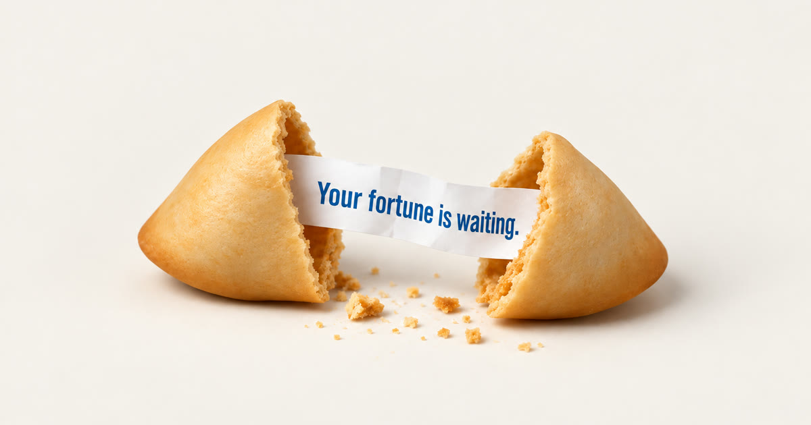

# Fortune Cookie

> Tap a fortune cookie. It snaps, the crumbs scatter, and a slightly crumpled slip of paper floats up with your fortune.
> The cookie obeys physics. The paper just does what it's told.



**🥠 Crack one open: <https://fortune-cookie-khaki.vercel.app>**

## What it does

1. A fortune cookie sits on a seamless white studio table, with the end of its slip poking out of one side.
2. Tap it. It snaps across the notch, the way a real one does: the two arms hinge apart, slide a few centimetres and rock to rest, and crumbs spill from the break.
3. The slip is drawn out of the half it was tucked into, straightens, and comes up to you while the table behind goes softly out of focus. It's a 57 × 16 mm slip in Wonton-Food blue, with lucky numbers on the front and a Learn Chinese lesson on the back. Tap the slip, or press **Turn over**, to read the back.
4. **Another cookie** clears the table and sets down a new one. Fortunes don't repeat until you've read the last 60.

## How it's made

- **The cookie is modelled the way it's folded.** A flat disc of batter, 80 mm across, is folded in half over the slip into a half-moon pocket. Then the middle of the straight fold is pushed in over a cup rim: the fold becomes the V-shaped notch, the half-moon becomes a horseshoe, and the two layers puff apart, the top doming up and the bottom down. [`blender/cookie_geom.py`](blender/cookie_geom.py) builds exactly that:
  - a fold line bent into a V with a rounded apex; each arm is a fat pocket that flattens to a pointed tip
  - the rim runs round the outside at its true length, the top rim resting just above the bottom one, with a thin seam that opens into the pocket mouth at the back
  - thinner, browner edges, lopsided arms and a wobbly rim
  - every vertex keeps its position on the original flat disc as its UV, so one texture atlas fits the whole cookie *and* every broken piece
  - checked against reference photos from above, in three-quarter view and from the back
- **Blender** ([`blender/build_cookie.py`](blender/build_cookie.py)) triangulates the disc and splits it along chipped break lines into five fracture variants (the crack runs from the apex of the notch to the back rim, across both layers). It solidifies the shell, bakes ambient occlusion in Cycles, and exports:
  - the meshes (glTF, meshopt-compressed)
  - convex-hull colliders and the mass and inertia of each piece: the cookie weighs 8 g
  - the pocket between the layers, where the slip is tucked
  - [`blender/build_studio.py`](blender/build_studio.py) renders the studio (a white sweep, softboxes) into the HDR light probe the page is lit with, plus a Cycles reference render used to calibrate the real-time look.
- **Textures:** the crust, the inside of the pocket, the broken edge and the paper fibre are macro scans made with the Codex CLI `imagegen` skill (`art/imagegen/`). They're made tileable and composited into the atlas with the browning a tray-baked disc gets toward its rim. The favicon and social card were made with `imagegen` too, from the Cycles render.
- **Physics:** [Rapier](https://rapier.rs) at 240 Hz. The halves and the crumbs are real rigid bodies with baked-batter friction and bounce, plus a little air drag, since an 8 g shell is mostly air. The snap is an impulse that levers the two arms apart about the back of the cookie. After that it's all simulation.
- **The slip isn't simulated.** It's animated on purpose: it rides in its half for a beat, slides out of the pocket the way it was pointing, and comes up to the reader. It keeps the creases it got in the cookie (faceted folds, a few crinkles, a curl) and is printed like the real thing:
  - condensed bold sans in blue, a register tab, and "Lucky Numbers" with six numbers from 1 to 56 in draw order
  - on the back, a Learn Chinese word in simplified characters with tone-marked pinyin
  - each side faintly shows through the other
- **Fortunes:** 246 of them in [`src/fortunes.js`](src/fortunes.js), written in the house style after reading a few hundred real slips. The 138 Learn Chinese entries were checked against CC-CEDICT.
- **Sound:** no audio files. The crack is a sharp broadband snap followed by a scatter of micro-fractures. Each landing makes a hollow tap, and each crumb a tiny tick, all driven by the physics contact impulses. The slip rustles when it comes out.

## Run it

```bash
npm install
npm run dev            # http://localhost:5173
npm run build          # static site in dist/
```

URL flags: `?seed=42` makes every cookie repeatable, `?manual` hands the clock to scripts (`window.__fc.advance(seconds)`), and `?lowres` forces the 2k textures.

Rebuilding the assets needs Blender 5:

```bash
Blender -b -P blender/build_cookie.py        # meshes, colliders, textures -> blender/baked, public/assets
Blender -b -P blender/build_studio.py        # studio light probe (-- --ref for the Cycles reference)
./scripts/assets.sh                          # webp + meshopt
```

Tests (Playwright; start `npx vite --port 5288` first):

```bash
node tests/stress.mjs   http://127.0.0.1:5288/ 30   # 30 cracks: nothing falls through the table, everything settles, fortunes stay fresh
node tests/shots.mjs    http://127.0.0.1:5288/      # stage-by-stage screenshots at phone and desktop sizes
node tests/realtime.mjs http://127.0.0.1:5288/ 390x844x3 3 webkit   # real taps, real clock
node tests/video.mjs    http://127.0.0.1:5288/ 390x844x2 5 3        # frame-by-frame video of a crack
```

## Deploying

The Vercel project `fortune-cookie` is connected to this repository: every push to `main` builds with Vite and goes live at <https://fortune-cookie-khaki.vercel.app>. The `.vercelignore` keeps the reference library, renders and Blender files out of CLI uploads.
