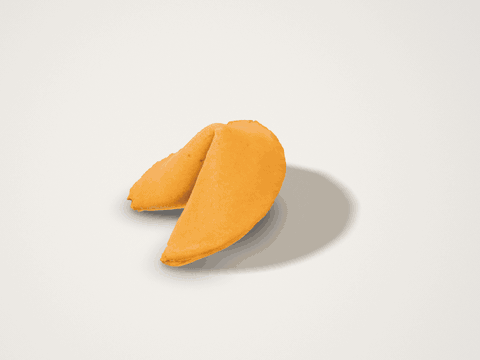
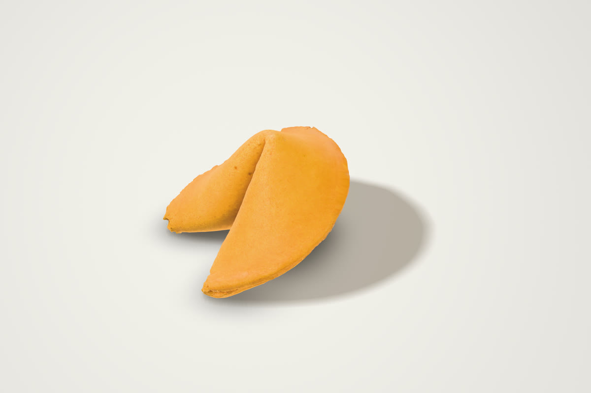
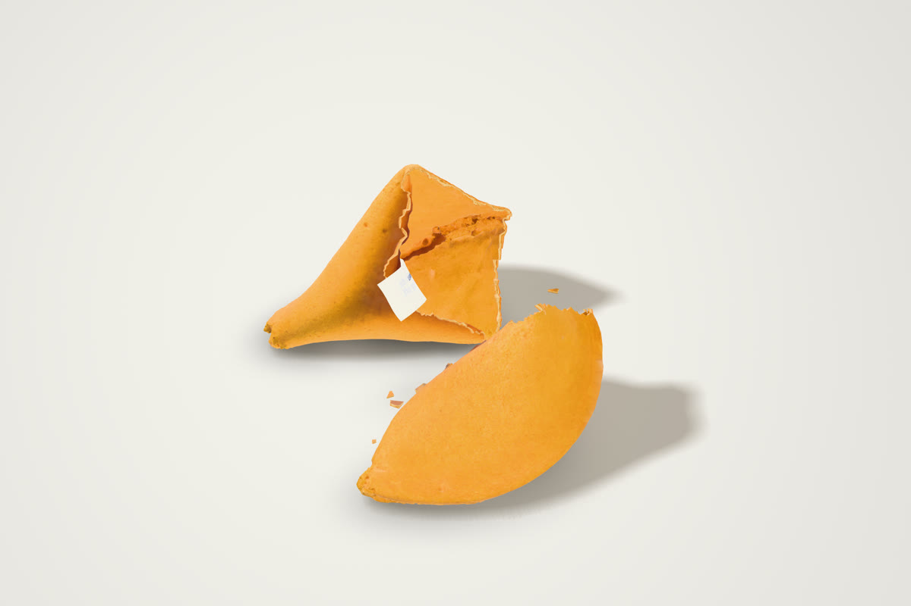
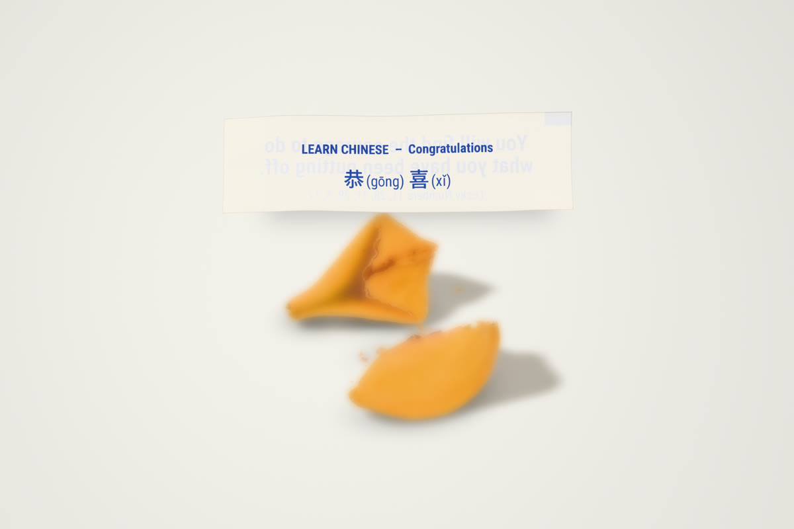

# 🥠 Fortune Cookie

> All of the wisdom. None of the calories. No need to order the General Tso's first.


**Crack one open: <https://davidyen1124.github.io/fortune-cookie/>**

## What is this?

It's the best part of Chinese takeout, minus the takeout. A fortune cookie sits on a white table, minding its own business. You tap it. It snaps in half, crumbs go everywhere, and a slightly crumpled slip of paper floats up to tell you something encouraging and unverifiable.



Everything on this page is a real screenshot of the site, not concept art. The cookie really does look like that.

## How to use

1. Think of a question. Or don't. The cookie wasn't going to answer it anyway.
2. Tap the cookie.
3. Read your fortune. Add "in bed" to the end if you're twelve, or if you're an adult at a restaurant with friends.
4. Tap the slip (or **Turn over**) to learn one Chinese word. This is the educational part. You're welcome.
5. Hit **Another cookie**. Nobody's counting. There's no bill.

| Before | During |
|---|---|
|  |  |

| Your fortune | The educational part |
|---|---|
|  |  |

## FAQ

**Is the fortune real?**
As real as any fortune that was mass-printed in Queens and baked into a cookie. These ones are picked by `Math.random()`, which has roughly the same qualifications.

**Why did I get the same cookie twice?**
You didn't. It's the same *scan* of one very photogenic cookie. But it breaks differently every time, the crumbs land where physics puts them, and the fortune won't repeat until you've read 60 others.

**Are the lucky numbers lucky?**
They're six numbers between 1 and 56, in the order they were drawn, exactly like the real slips. Whether they're lucky is between you and your state lottery commission.

**Can I eat it?**
It weighs 8 grams and is made of triangles.

**Why is the Chinese on the back in Traditional characters?**
Real American slips use Simplified. The management of this repository prefers Traditional. The management has spoken.

**The cookie didn't crumble enough / crumbled too much.**
Take it up with Newton.

## What's inside

- **A real cookie.** The model is a photogrammetry scan, ["Fortune Cookie" by Frank McMains](https://sketchfab.com/3d-models/fortune-cookie-47018f5b63ef477484f5e25debb484df), stitched from about 350 photos of an actual cookie. An earlier version of this project used a cookie modelled by hand. Its first reviewer said it looked "like shit". The real one is better.
- **Blender** ([`blender/build_scan.py`](blender/build_scan.py)) does the prep work:
  - works out which way the cookie is facing from its own symmetry, and scales it to life size (about 50 mm across)
  - removes the slip that was sticking out of the scanned cookie and patches the shell, so the fortune stays a surprise
  - cuts the cookie into two hollow halves along a chipped line, four different ways
  - exports the meshes, collision shapes, and the mass and balance of every piece
  - [`blender/build_studio.py`](blender/build_studio.py) renders the white photo studio the page is lit with.
- **Physics:** [Rapier](https://rapier.rs) at 240 Hz. The halves and crumbs are real rigid bodies with their own weight, friction and bounce. The snap is one shove that levers the two arms apart. After that, nobody is in charge.
- **The slip** is the one thing that *doesn't* obey physics, on purpose. It hides inside the cookie, wrapped round the notch like in a real one, then slides out and floats up to be read. It's a faithful copy of a real slip:
  - 57 × 16 mm, blue ink, condensed bold type, a little blue register mark in the corner
  - "Lucky Numbers" on the front, a Learn Chinese word with pinyin on the back
  - you can faintly see each side through the other, because the paper is cheap
- **Fortunes:** 246 of them in [`src/fortunes.js`](src/fortunes.js), written in the house style after reading a few hundred real slips. The 138 Learn Chinese words were checked against a dictionary, which is more than can be said for some real slips.
- **Sound:** there are no audio files. The crack, the taps of the halves landing, the ticks of the crumbs and the rustle of the paper are all synthesized on the spot from what the physics engine says just happened.
- **Rendering:** [three.js](https://threejs.org). When the slip comes up, the table behind it goes softly out of focus, the way it would through a macro lens.
- **Textures for the broken edge and the paper** were made with the Codex CLI `imagegen` skill (`art/imagegen/`). The cookie's own surface is the scan's photo texture.

## Run it locally

```bash
npm install
npm run dev        # http://localhost:5173
npm run build      # static site in dist/
```

URL flags: `?seed=42` makes every cookie repeatable, `?manual` hands the clock to scripts (`window.__fc.advance(seconds)`), and `?nodof` turns off the depth of field.

Rebuilding the assets needs Blender 5:

```bash
Blender -b -P blender/build_scan.py      # scan -> meshes, collision shapes, photo texture
Blender -b -P blender/build_studio.py    # studio light probe
./scripts/assets.sh                      # webp + mesh compression
```

Tests use Playwright (start `npx vite --port 5288` first):

```bash
node tests/stress.mjs   http://127.0.0.1:5288/ 30                    # 30 cracks: nothing falls through the table, everything settles
node tests/realtime.mjs http://127.0.0.1:5288/ 390x844x3 3 webkit    # real taps, real clock, phone size
node tests/shots.mjs    http://127.0.0.1:5288/                       # stage-by-stage screenshots
node tests/press.mjs    http://127.0.0.1:5288/                       # the screenshots in this README
```

## Deploying

Pushing to `main` runs [a GitHub Actions workflow](.github/workflows/pages.yml) that builds with Vite and publishes `dist/` to GitHub Pages. The build uses relative paths, so it works under `/fortune-cookie/` or anywhere else.

## Credits

- Cookie model: "Fortune Cookie" by [Frank McMains](https://sketchfab.com/frankmcmains), licensed [CC BY 4.0](https://creativecommons.org/licenses/by/4.0/). Changes made here: rescaled and turned, simplified, slip removed and the shell patched, cut into halves.
- The cookie that was scanned. It gave everything.
